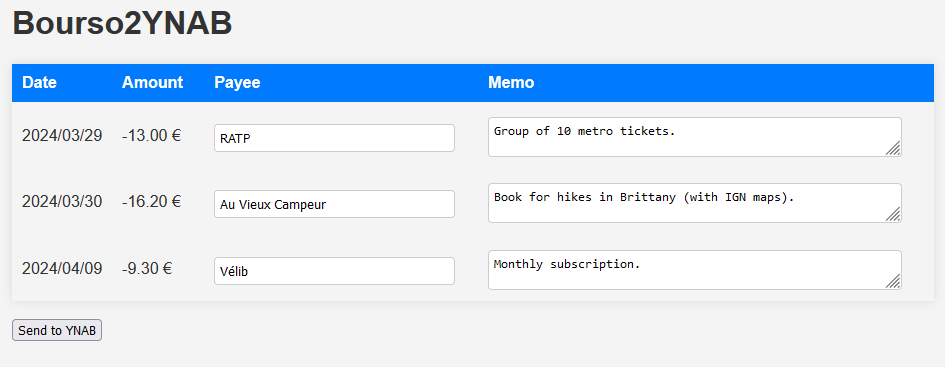

# bourso2ynab
Utility to easily import Boursobank transactions (formally Boursorama) into YNAB.



### How it works

This project is inspired from the wonderful [Fintech to YNAB](https://github.com/syncforynab/fintech-to-ynab) repo. I was a happy user until I moved to France and had to stop using Monzo.

- Download a CSV of your Boursobank transactions and upload them to the service.
- The file content will be converted to a YNAB-friendly format.
- Bourso2YNAB remembers the name of your previous payees. For instance, it will automatically convert "VELIB METROPOLE PARIS FR" into the friendlier "Vélib" (as long as you've done this renaming yourself once before).
- The data is sent to your YNAB account. No need to enter the data manually anymore!

The data processing is completely local. No telemetry or data is sent anywhere besides to YNAB itself.

## Deployment

1. Create a .env file with the following content:
```bash
YNAB_API_KEY=YOUR_YNAB_API_KEY
APP_SECRET_KEY=YOUR_APP_SECRET_KEY
```
2. Create a `secrets.json` file. This file will be used to track YNAB users, budgets and accounts. Here's an example of what it could look like:
```json
{
    "budgets": {
        "user1": "BUDGET_ID_FOR_USER_1",
        "user2": "BUDGET_ID_FOR_USER_2"
    },
    "accounts": {
        "user1": {
            "account_unique_user1": "ACCOUNT_ID_UNIQUE_TO_USER_1",
            "account_joint": "ACCOUNT_ID_FOR_JOINT_ACCOUNT"
        },
        "user2": {
            "account_unique_user2": "ACCOUNT_ID_UNIQUE_TO_USER_2",
            "account_joint": "ACCOUNT_ID_FOR_JOINT_ACCOUNT"
        }
    }
}
```  

If an account has a name "joint" then everytime one user uploads transactions with this account, the transactions are actually impacting _all_ users. This is useful for joint accounts, assuming the owners of the joint account are using the same YNAB account.

3. Create an empty `db.json` file. This file will be used to store the name of the payees as they appear in Bourso (e.g. "VELIB METROPOLE PARIS FR") and their renamed counterpart (e.g. "Vélib").
4. Edit the `docker-compose.yml` so it fits your needs (ports, volumes, etc.)
5. Build and run the container:
```bash
docker build -t bourso2ynab -f Dockerfile .
docker-compose up -d
```
